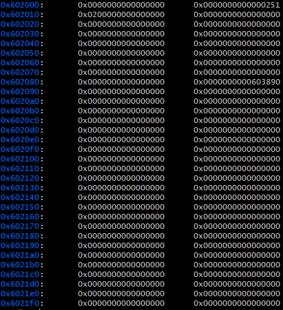
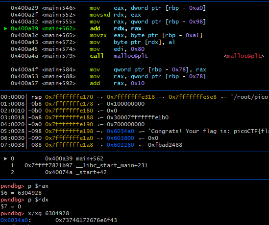
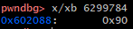
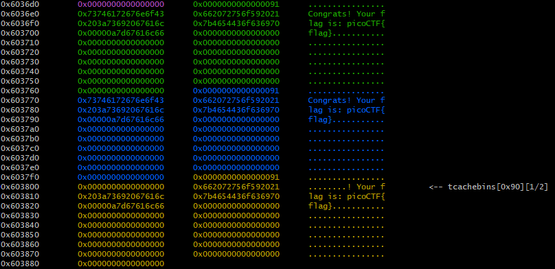

# Cache Me Outside picoCTF 2021

## Solve locally and remote
- `chmod +x ./heapedit`
- `../../pwninit`
- `./cmo.py`
- `./cmo.py REMOTE`

## Explanation
As the hint suggests, this problem is focused on the tcache. The tcache is a glibc feature to speed up memory allocation in user space. It is used to cache previously freed memory chunks.
This means, that freed memory chunks are not cleaned up from the heap i.e. merged/coalesced with other free heap memory. Instead they are stored in so called bins inside the tcache for later reuse.
Subsequent malloc calls that request a size of memory, that matches a tcached chunk will allocate that chunk and remove it from the cache. Mallocs of this type do not have to go to the lengthy
process of requesting memory from the kernel via mmap.

Each thread has its own tcache. One of the reasons it was designed this way, is to prevent handling race conditions between threads.
In order to tackle the cache me outside problem, we have to understand two important tcache structures.

```
source: https://elixir.bootlin.com/glibc/latest/source/malloc/malloc.c#L3125

# define TCACHE_MAX_BINS 64
# define TCACHE_FILL_COUNT 7
/* When "x" is from chunksize().  */
# define csize2tidx(x) (((x) - MINSIZE + MALLOC_ALIGNMENT - 1) / MALLOC_ALIGNMENT)

/* We overlay this structure on the user-data portion of a chunk when
   the chunk is stored in the per-thread cache.  */
typedef struct tcache_entry
{
  struct tcache_entry *next;
  /* This field exists to detect double frees.  */
  uintptr_t key;
} tcache_entry;

/* There is one of these for each thread, which contains the
   per-thread cache (hence "tcache_perthread_struct").  Keeping
   overall size low is mildly important.  Note that COUNTS and ENTRIES
   are redundant (we could have just counted the linked list each
   time), this is for performance reasons.  */
typedef struct tcache_perthread_struct
{
  uint16_t counts[TCACHE_MAX_BINS];
  tcache_entry *entries[TCACHE_MAX_BINS];
} tcache_perthread_struct;
```

By default, each thread has 64 singly-linked tcache bins. Each bin contains a maximum of 7 same-size chunks. The 64 bins are stored in the tcache_entry array entries of the tcache_perthread_struct.
The index for each bin is based on the respective chunk size. Once a chunk of memory is freed, the bin index is calculated using ` csize2tidx(x) (((x) - MINSIZE + MALLOC_ALIGNMENT - 1) / MALLOC_ALIGNMENT)`.

To understand, what the cache me outside tcache looks like, we first decompile the binary i.e. using an online decompiler like https://dogbolt.org/. After renaming some variables and translating string hex values
to their resective ascii characters, we get a main function that looks something like this.

```c
undefined8 main(void)
{
  long in_FS_OFFSET;
  undefined value_chg;
  int addr_chg;
  int i;
  undefined8 *first_new_mem_p;
  undefined8 *new_mem_p;
  FILE *flag;
  undefined8 *sorry_new_mem_p;
  void *result_printed;
  char rand_string [25];
  char flag_cont_buf [72];
  long local_10;
  
  local_10 = *(long *)(in_FS_OFFSET + 0x28);
  setbuf(stdout,(char *)0x0);
  flag = fopen("flag.txt","r");
  fgets(flag_cont_buf,0x40,flag);
  rand_string = "this is a random string.\0";
  first_new_mem_p = (undefined8 *)0x0;
  for (i = 0; i < 7; i = i + 1) {
    new_mem_p = (undefined8 *)malloc(0x80);
    if (first_new_mem_p == (undefined8 *)0x0) {
      first_new_mem_p = new_mem_p;
    }
    *new_mem_p = "Congrats! Your flag is: \0";
    strcat((char *)new_mem_p,flag_cont_buf);
  }
  sorry_new_mem_p = (undefined8 *)malloc(0x80);
  *sorry_new_mem_p = "Sorry! This won't help you: \x00\x00\x00\x00\0";
  strcat((char *)sorry_new_mem_p,(char *)&rand_string);
  free(new_mem_p);
  free(sorry_new_mem_p);
  addr_chg = 0;
  value_chg = 0;
  puts("You may edit one byte in the program.");
  printf("Address: ");
  __isoc99_scanf(&DAT_00400b48,&addr_chg);
  printf("Value: ");
  __isoc99_scanf(&DAT_00400b53,&value_chg);
  *(undefined *)((long)addr_chg + (long)first_new_mem_p) = value_chg;
  result_printed = malloc(0x80);
  puts((char *)((long)result_printed + 0x10));
  return 0;
}
```
The program allocates seven chunks of memory inside the for loop. An additional pointer to the first chunk allocated is created. Each chunk has a size of 0x80 bytes and is populated with a string
message "Congrats! Your flag is: " appended by the content of the flag.txt file. After the loop, one more chunk of memory is allocated containing a random string. Again its size is 0x80.
So far the tcache is empty, since no memory has been freed yet. Next two chunks of memory are freed. At this point one of the tcache bins should contain two entries, since both chunks were the
same size. We can check this easily be having a look at the counts array. All its bytes should be zero apart from one byte with value 2. We can examine the heap in gdb by first having a look at the
`info proc mappings`. We can then look for the heap starting address. From there we can start inspecting the following memory addresses as much as we need using `x/64xg <heap-starting-address>`.



We find the expected count value on line two. Inside the tcache_perthread_struct after the entries array follows right after the counts array. We know that only one bin contains entries. We also
know, that entries inside the same bin form a singly-linked list and that the address to the list head is stored inside the entries array. Taking another look at the memory following our counts value,
we find the first non zero value. This should be the address of the list head. The next call to malloc matching the bin size, will return a pointer to this value aka the list head address.
 
Continuing the program, we are asked to input an address for which we would like to change the stored value in memory. We are promted a second time to enter the respective value.
Taking a look at the next line, we can see, that the address we provide as input is added to another address. In fact, it is the address of the first chunk of memory we allocated inside the loop.
This means we have to calculate the address in memory, we would like to access, based on the address of the first chunk of memory we allocated.

Right before the program returns, we can see, that another 0x80 byte sized chunk ist allocated. Beginning from the address returned by this call to malloc plus 16, a string is then printed.
We know, that the address returned by this malloc is the value of the entries list at the respective chunk size index. In order to solve the problem, we somehow have to change that value to an
address to a memory location, that contains the flag.

Taking a look at the memory layout again, we can tell that the address to entries element we would like to change is `0x602088`. We can validate this using `x/xg 0x602088`. This should return the
bins list head address value from before. In order to calculate the difference to the first_new_mem_p value, we first have to find out this address value. We can do so by entering zero when
promted to enter an address and then inspecting the rax register.



Calculating the delta between our target address and the address pointed to by first_new_mem_p gives us `5144`. This means, that we are 5144 bytes higher in memory, than our target address. Hence
the value we have to enter as address offset the next time we run the program is `-5144`. Note that when calculating the delta the addresses used might be different for you due to address randomization.

Finally we have to figure out what we should adjust the value to. The value of the exact byte at our target address is `0x90`.

 

This means, we can not change the entire address returned by the final malloc inside the tcache, but only one byte of this address. Either we find a memory location where the flag is stored by just
changing the `0x90` value, or we might have to adjust our target address again in order to change a different byte within the list head address. Let's inspect the heaps chunks. Pwndbg simplifies this
for us. We can simply use the `vis_heap_chunks` command. We have to remember, to take the 16 byte offset into account when inspecting the potential chunk candidates. If we were to start with a
zero value for the changed byte we would get `0x603800 + 0x10`. Taking a look at the heap chunks, shows us, that there is indeed a chunk at address `0x603800` and even though we might cut some part
of the contained string by only reading from address `0x603800`, we will still get our flag printed.


